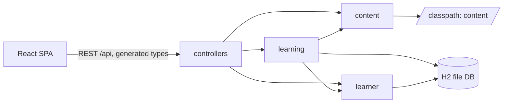
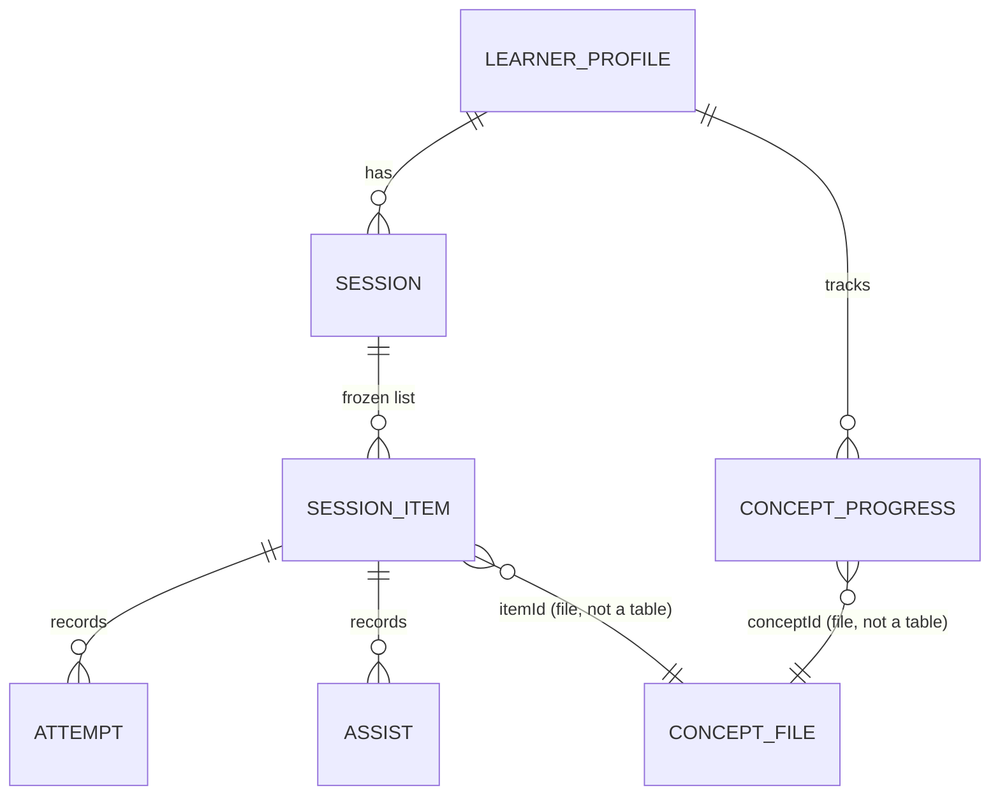
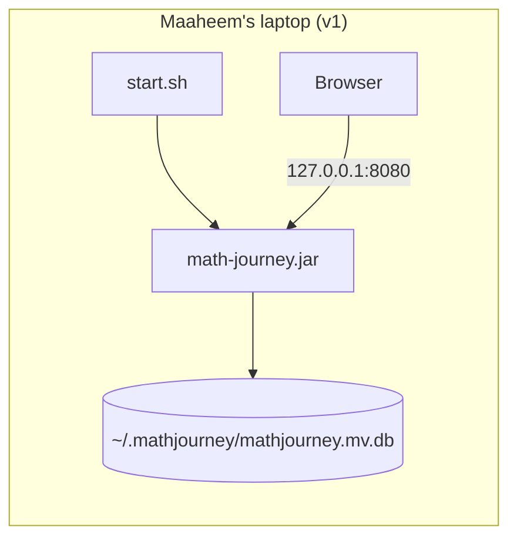

# Architecture Spine: Math Journey

## Design Paradigm

The backend is a **modular monolith**: one Spring Boot app split into modules by domain, each layered `web → service → repository`. Modules talk to each other only through service interfaces. The frontend is a **content-driven renderer**: React looks up each activity's `kind` in a closed registry and draws it, and the behavior comes from the lesson data.

| Module | Backend package | Owns |
| --- | --- | --- |
| content | `app.mathjourney.content` | Loading and validating `curriculum.json`, concept files and kind schemas; answer verification; read-only concept catalog |
| learning | `app.mathjourney.learning` | Sessions (daily and replay), item state, attempts, Leitner progress, streak, day number |
| learner | `app.mathjourney.learner` | Single learner profile: onboarding stage, settings (sound, companion name) |
| web | `app.mathjourney.web` | Serving the built React assets; SPA fallback for every non-`/api` path |



Dependencies run only in the arrow directions. `learner` never depends on `learning`. `content` depends on nothing else, and it never touches the database.

## Invariants & Rules

### AD-1: One deployable [ADOPTED]

- **Binds:** build, run, deployment
- **Prevents:** two runtimes and ports drifting apart; CORS settings diverging between dev and prod
- **Rule:** Production is a single Spring Boot jar that serves the built React assets and `/api` on one origin. In development, the Vite dev server proxies `/api` to Spring. No CORS configuration exists. Unknown `/api/**` paths return a 404 ProblemDetail and are never swallowed by the SPA fallback.

### AD-2: Learning logic lives only in the backend [ADOPTED]

- **Binds:** learning, learner, frontend
- **Prevents:** learning rules duplicated in Java and TypeScript and drifting apart
- **Rule:** Session assembly, review selection, Leitner moves, mastery labels, try counts, assist stage, streak, day number, land unlock and resume position are computed **only** in Spring. React renders what the API returns and never derives or stores any of these values.

### AD-3: Answers are compared in the browser and verified in the backend [ADOPTED]

- **Binds:** content, frontend, activity kinds
- **Prevents:** two implementations disagreeing about whether an answer is correct
- **Rule:**
  - **Kind schema.** Each kind's schema defines a discrete response shape (drag positions snap to a grid or slot), a canonical answer form, and the equivalence rule: ordered or set comparison, plus an optional list of accepted alternatives.
  - **React** turns her response into canonical form and **compares** it with the item's expected canonical answer(s). It does no math evaluation.
  - **Java.** For each kind, an `AnswerVerifier` **computes** the answer from the problem, and it must match the stored answer.
  - **Shared fixtures.** Fixture files of response → canonical value → verdict under `content/fixtures/<kind>/` are tested in both Java and TypeScript.

### AD-4: The server owns item state, and attempts are idempotent [ADOPTED]

- **Binds:** learning, frontend, persistence
- **Prevents:** a resumed item restarting at try 1; double-counted attempts; competing writers to progress
- **Rule:**
  - **The server owns each item's state:** tries used and assist stage (`none → hint → walkthrough`).
  - **Attempts.** React posts `POST /api/sessions/{sessionId}/items/{itemId}/attempts` with a client-generated `attemptId` UUID, which the server de-duplicates. The server derives the try number.
  - **"I'm stuck."** It posts `.../assists`, which moves the stage forward one step: to `hint`, then to `walkthrough`.
  - **Wrong answers.** The 2nd wrong try moves the stage to `hint`, and the 3rd moves it to `walkthrough`.
  - **Item completion.** An item is complete when answered correctly, or when the walkthrough's similar problem has been attempted.
  - **One writer.** Only `learning`'s service writes attempts, item state, progress and session position, in one transaction per request. Attempts are append-only.

### AD-5: Lesson content is read-only data held to schemas [ADOPTED]

- **Binds:** content, content authoring, frontend types
- **Prevents:** lessons quietly requiring code changes; schema drift across lesson JSON, Java and TypeScript; unverified answers reaching Maaheem
- **Rule:** All content lives under `content/` and is packaged into the jar. The **concept envelope** (AD-12), the **curriculum** (AD-13) and **one schema per activity kind** are the single sources for:
  - (a) startup validation,
  - (b) Java loading, and
  - (c) the TypeScript types generated at build.

  The app **refuses to start** if any file fails its schema, cross-validation or answer verification. Lesson content is never stored in the database.

### AD-6: The activity-kind registry is closed

- **Binds:** content, frontend, backend content module
- **Prevents:** a lesson referencing a manipulative that has no renderer or verifier
- **Rule:** A kind exists only when it has all four: a schema, a Java `AnswerVerifier`, a React renderer registered under the same `kind` key, and shared fixtures (AD-3). A new lesson needs no code. A new kind is a code story that adds all four together.

### AD-7: Two generated type sources, never overlapping [ADOPTED]

- **Binds:** web, frontend
- **Prevents:** hand-written TypeScript copies drifting from Java; the same payload typed twice
- **Rule:**
  - **API types** are generated with openapi-typescript from the OpenAPI document. springdoc publishes that document, and it is exported to `frontend/openapi.json` during the Maven build.
  - **Activity payloads** cross the API as opaque JSON objects. Their TypeScript types come **only** from the content schemas.
  - **No hand-written types.** The frontend contains no hand-written API or payload types.

### AD-8: Leitner scheduling, at most one move per concept per day [ADOPTED]

- **Binds:** learning
- **Prevents:** a concept reaching "easy" on its first day; screens disagreeing on mastery
- **Rule:**
  - **Progress rows.** A concept gets a progress row (box 1, due the next day) when it is *introduced* (AD-13).
  - **When the box moves.** A concept's box moves **at most once per day**, when its last item in that day's daily session completes, based on that day's attempts:
    - any walkthrough → box 1;
    - every item correct on try 1 with no assist → up one box (maximum 5);
    - otherwise → unchanged.
  - **Intervals:** box 1 → 1 day, 2 → 3, 3 → 7, 4 → 14, 5 → 30.
  - **Labels** are derived, never stored: no row = *not started*, boxes 1–2 = *new*, 3–4 = *practicing*, 5 = *easy*.
  - **Warm-up.** It takes up to 8 due concepts, most overdue first, then fills from introduced concepts that are closest to due, with one `review` item each. It is skipped when no concept has been introduced yet.

### AD-9: "Today" belongs to the server's clock [ADOPTED]

- **Binds:** learner, learning
- **Prevents:** the streak, day number and "done for today" disagreeing across a time zone or midnight
- **Rule:** The current day is `LocalDate.now(ZoneId.of(app.timezone))`, with default `America/New_York`, and is computed only in the backend. Every stored date is a `LocalDate` day key in that zone, and every timestamp is UTC `Instant`.

### AD-10: Content IDs are permanent [ADOPTED]

- **Binds:** content, learning, persistence
- **Prevents:** progress or attempts left pointing at a renamed concept or item
- **Rule:**
  - **Concept ID:** `<ccss-code>-<kebab-slug>` (for example, `8.EE.7-two-step-equations`), and it equals the file name.
  - **Item ID:** `<conceptId>#<slug>`.
  - **Once shipped,** neither is renamed or reused. Retiring one means keeping it in the file with `retired: true`.

### AD-11: Flyway owns the schema, and SQL stays portable [ADOPTED]

- **Binds:** persistence
- **Prevents:** schema drift from Hibernate auto-DDL; H2-only SQL blocking a later move to Postgres
- **Rule:** The schema changes only through Flyway migrations, and `spring.jpa.hibernate.ddl-auto=validate`. Migrations use ANSI SQL that runs on both H2 and PostgreSQL.

### AD-12: Concept envelope [ADOPTED]

- **Binds:** content authoring, content, learning
- **Prevents:** the author and the loader inventing different shapes for roles, hints and walkthroughs
- **Rule:** `content/schemas/concept.schema.json` defines each concept file: `id`, `land`, `ccss`, `title`, `reviewed` (bool), `retired` (bool) and `items[]`. Each item has: `id`, `role` (`discover`, `practice`, `review` or `challenge`), `kind`, `payload` (validated by the kind's schema), `nudge`, `hint`, and `walkthrough { steps[], similar }`.
  - **Minimum items per concept:** 1 `discover`, 4 `practice`, 3 `review`, 1 `challenge`.
  - **Verification:** every node that carries an answer is verified (AD-3), including each walkthrough's `similar` problem.

### AD-13: Curriculum and progression [ADOPTED]

- **Binds:** content, learning, map
- **Prevents:** the map, current stop and unlock logic disagreeing on order or membership
- **Rule:**
  - **Single source.** `content/curriculum.json` is the only source of order: lands in order (Numbers, Equations, Functions, Shapes, Data), each with an ordered list of concept IDs, plus a separate `prerequisites` list of grade 6–7 concepts. Startup cross-validates it against the concept files.
  - **Introduced.** A concept is introduced when its first `discover` item in a daily session completes.
  - **Unlocking.** A land is complete when all of its concepts are introduced, and that unlocks the next land.
  - **Review gate.** Only concepts with `reviewed: true` can be scheduled as new. This is the parent-skim gate. If the next concept isn't reviewed yet, the session has no new-idea part.

### AD-14: Daily session lifecycle [ADOPTED]

- **Binds:** learning, frontend
- **Prevents:** sessions recomputed between reads; broken resume; duplicate sessions per day
- **Rule:**
  - **Get or create.** `POST /api/sessions/today` gets or creates the session. It is idempotent, and sessions are unique per (`dayKey`, `type=daily`).
  - **Frozen items.** At creation, the full item list is **frozen**, each item with a `part` and a `seq`:
    - **warm-up:** per AD-8;
    - **new idea:** the next `app.new-concepts-per-day` concepts (default 1, maximum 2), each with its `discover` and `practice` items;
    - **wrap-up:** today's `challenge` plus up to 2 `review` items from earlier concepts, ending on an item from a concept in box ≥3. If no concept is in box ≥3, it ends on today's last practice item.
  - **Breaks** come after the warm-up and after the new idea.
  - **Position.** The position is (`currentItemId`, `atBreak`), stored on the server.
  - **Day boundary.** A session belongs to its creation day. When a new day's session is created, any unfinished earlier session is marked `abandoned`.

### AD-15: Onboarding stage [ADOPTED]

- **Binds:** learner, learning, frontend
- **Prevents:** the first-run flow and the prerequisite check being built inconsistently, or skipped
- **Rule:**
  - **Stage.** The learner profile holds the `onboardingStage` (`welcome`, `prereq-check` or `journey`). React routes by that stage alone.
  - **Prerequisite check.** It is a session of `type=prereq` made from `review` items of the concepts in `curriculum.prerequisites`.
  - **Gaps.** Each prerequisite concept she gets wrong is seeded with box 1, due today, so it shows up in her first warm-ups.

### AD-16: Streak and replay [ADOPTED]

- **Binds:** learning
- **Prevents:** the streak owned in two places; replay corrupting progress
- **Rule:**
  - **Streak and day number** are derived in `learning`:
    - **Streak:** the number of consecutive day keys with a `completed` daily session, ending today or yesterday.
    - **Day number:** the count of completed daily sessions.
  - **Replay.** Replay from Land detail creates a `type=replay` session. Its attempts are recorded, but they **never** move Leitner boxes or the streak.

### AD-17: Runtime and data location [ADOPTED]

- **Binds:** deployment, operations
- **Prevents:** progress stored in whatever folder the jar was started from; content drifting from code
- **Rule:**
  - **Content** is packaged in the jar's classpath under `content/`.
  - **Data** lives in `${app.data-dir}`, defaulting to `${user.home}/.mathjourney`.
  - **Start.** A `start.sh` script starts the jar.
  - **Upgrade.** Replace the jar and restart. Flyway migrates on startup.
  - **Bind address.** `server.address` defaults to `127.0.0.1`, so tablet use means the laptop's own touch screen.
  - **Java check.** `start.sh` checks for Java 25 and, if it's missing, prints install instructions and exits. The app does not bundle a JDK.

## Consistency Conventions

| Concern | Convention |
| --- | --- |
| Naming | Java packages `app.mathjourney.<module>`; REST paths are plural kebab-case nouns under `/api`; JSON fields are camelCase; activity kinds are kebab-case (`balance-scale`) |
| IDs | Concept and item IDs per AD-10; database IDs and `attemptId` are UUIDs |
| Dates and times | Day keys are ISO `YYYY-MM-DD` (AD-9); timestamps are ISO-8601 UTC |
| Errors | `spring.mvc.problemdetails.enabled=true` plus one global `@RestControllerAdvice`; every non-2xx response is a `ProblemDetail` (RFC 9457); React shows a friendly Lumi-voiced message and never raw errors |
| Mutation | Writes go only through module services, never from controllers to repositories. One transaction per request. |
| Config | All configuration lives in `application.yml` under `app.*` (`app.timezone`, `app.data-dir`, `app.new-concepts-per-day`) |
| Auth | None (one learner per installation) |
| Logging | SLF4J with a module name on every line; content failures are logged with file and JSON path |
| Tests | Every kind has `AnswerVerifier` unit tests and shared fixtures tested in Java and TypeScript; `./mvnw verify` runs content validation, backend tests, the frontend build and frontend tests |

## Stack

| Name | Version |
| --- | --- |
| Java (JDK) | 25 LTS |
| Spring Boot | 4.1.x (4.1.1 at review; choose **Maven** and **Java 25** explicitly in Initializr) |
| springdoc-openapi-starter-webmvc-ui | 3.1.x |
| spring-boot-starter-flyway / Flyway | Boot-managed (Flyway 12.4.x); add `flyway-database-postgresql` only when moving to Postgres |
| H2 Database | Boot-managed (2.4.x) |
| Maven + frontend-maven-plugin | Maven wrapper; frontend-maven-plugin 2.0.2 with Node 22 LTS pinned |
| TypeScript | 6.0.x, pinned, with npm `overrides` for openapi-typescript's peer |
| React | 19.x (19.3 current) |
| Vite | 8.3.x |
| openapi-typescript | 7.13.x |
| dnd-kit | @dnd-kit/core 6.3.1 + @dnd-kit/sortable 10.0.0 |

Starters: Spring Initializr (Maven, Java 25: Web, Data JPA, Flyway, H2, Validation) and `npm create vite@latest` with the `react-ts` template.

## Structural Seed

```text
math-journey/
  start.sh
  backend/
    src/main/java/app/mathjourney/{content,learning,learner,web}/
    src/main/resources/db/migration/    # Flyway V1__init.sql ...
  frontend/
    src/activities/<kind>/              # one renderer per kind (AD-6)
    src/api/                            # generated API types only (AD-7)
    src/content-types/                  # generated from content schemas (AD-7)
    src/screens/                        # Welcome, PrereqCheck, Map, Session, LandDetail, Settings
  content/                              # packaged into the jar (AD-17)
    curriculum.json                     # AD-13
    schemas/concept.schema.json         # AD-12
    schemas/<kind>.schema.json          # AD-5
    fixtures/<kind>/                    # AD-3
    concepts/<conceptId>.json           # AD-10
```





`LEARNER_PROFILE` has exactly one row per installation. Each family runs its own copy.

## Deferred

| Item | Why it can wait / revisit when |
| --- | --- |
| Free hosting provider and production database (likely managed Postgres) | Local-only for v1; AD-1, AD-11 and AD-17 keep the move to configuration. Revisit when hosting is planned. |
| Accounts and multiple learners | Each family runs its own copy. Revisit if a shared site is wanted. |
| Backup of progress | Losing progress is acceptable in v1. |
| Activity kinds beyond the seven seed kinds (balance-scale, number-line, coordinate-graph, shape-transform, volume-fill, sort-match, scatter-plot) | AD-6 governs how kinds are added; decide per story. |
| Migrating to @dnd-kit/react | Revisit when it reaches 1.0; renderers stay behind the AD-6 registry. |
| Sound assets, illustration pipeline | No risk of units diverging |
| Frontend state library | Server state comes only from the generated API, and screen state is local. Choose at scaffold. |
| CI provider | Local `./mvnw verify` is the gate for now |
| A separate tablet on home Wi-Fi | Revisit if she wants to use one: set `server.address=0.0.0.0` and open the laptop's LAN address. There is no auth, so only on a trusted home network. |
| Bundling a JDK in the start script | Revisit if installing Java 25 on her laptop is a hassle |
